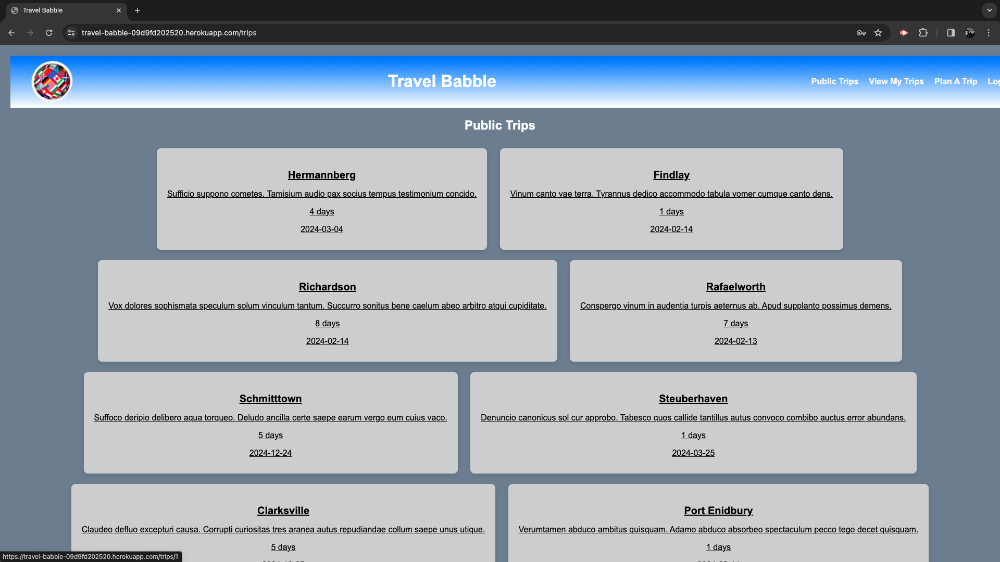

# Travel Babble

## License
  

  This project is licensed under the MIT license.
  
<a href= "https://choosealicense.com/licenses/mit/">link to MIT license</a>

## Description
To provide users the ability to plan a trip, look back at your saved trips and all public trips and finally be able to click into those trips and review trip details, and to allow other users to comment and suggest other attractions, restaurants and activities for your trip itinerary.

## Table of Contents
- [License](#license)
- [Installation](#installation)
- [Usage](#usage)
- [Contributing](#contributing)
- [Tests](#tests)
- [Questions](#questions)

## Installation
Node.js and Express.js to create a Restful API, Handlebars.js as the template engine, Mysql and Sequelize ORM for the database. Faker is our new technology that we used and finally Express-session for authentication.

## Usage
When you arrive at our homepage and want to plan a trip or view any trips. You are prompted to signup or login. Once logged in you are brought to the public trips page were you can view public trips and get ideas on where youd like to plan your next getaway. Once you have decided on a destination you can plan a trip where you can add where you are going, for when you leave, how long youre staying, a description of your trip and your planned accommodations. Once you have added your trip then you can review it in your saved trips by clicking into it and reviewing your trip details. You can then add it to the public trips to have other users comment on different attractions, restaurants and other activities for that area you are traveling to.

## Contributing
Winston "Schtitle24" Steidley, Peter Martin, Bilal Khan, Eric Reyna are the developers for this application.

## Tests
Live Link:
https://travel-babble-09d9fd202520.herokuapp.com/

Repository Link:
https://github.com/pm-912/travel-planner

## Questions
For additional questions, you can reach us through:
- GitHub: [Schtitle24, Pm-912, Bilalk789, Ereyna21](https://github.com/Schtitle24, Pm-912, Bilalk789, Ereyna21)
- Email: Steidley.winston@gmail.com, Peterleemartin@gmail.com, Bilalk6789@yahoo.com, Ereyna21075@gmail.com

